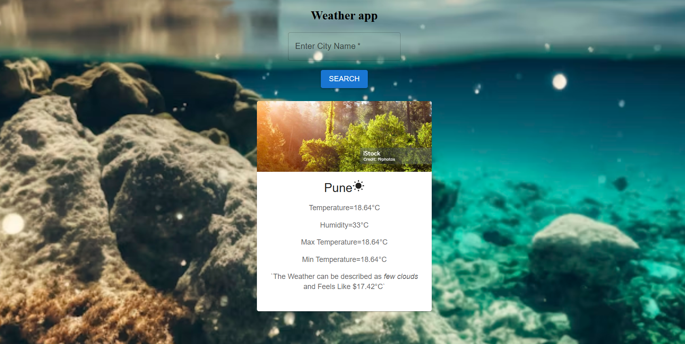

# 🌦 WeatherXpert

WeatherXpert is a simple and elegant weather application that provides real-time weather updates for any location. Built with React and powered by the OpenWeather API, this app delivers accurate temperature, humidity, and weather conditions.

## 🚀 Features
- 🌍 Search for any city worldwide
- 🌡 Displays temperature, humidity, and weather conditions
- ☁ Dynamic weather icons
- 🎨 Beautiful background with a modern UI
- 📡 Fast and reliable weather updates

## 🛠 Tech Stack
- **Frontend:** React, Vite, Material UI
- **API:** OpenWeather API
- **Deployment:** Vercel

## 📦 Installation

1. **Clone the repository:**
   ```sh
   git clone https://github.com/prajwalghurde/Weather-App.git
   cd Weather-App
   ```

2. **Install dependencies:**
   ```sh
   npm install
   ```

3. **Create a `.env` file** and add your OpenWeather API key:
   ```sh
   VITE_API_KEY=your_openweather_api_key
   ```

4. **Run the app:**
   ```sh
   npm run dev
   ```

## 🌍 Live Demo

Check out **[WeatherXpert](https://weatherxpert-sand.vercel.app/)** to see the app in action!

## 📸 Preview



## 🏆 Credits
- **Developer:** [Prajwal Ghurde](https://github.com/prajwalghurde)
- **API:** [OpenWeather API](https://openweathermap.org/api)
- **Icons & UI:** Material UI

## 📜 License
This project is open-source and available under the MIT License.

---

🌟 **Enjoy using WeatherXpert! Feel free to contribute or give feedback.** 🚀

